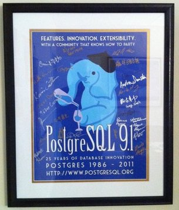

!SLIDE only-title

# Capítulo 2 #

# Bases de Datos Relacionales #

!SLIDE
# BBDD Relacionales #
* Algunas observaciones para ampliar nuestra perspectiva

!SLIDE incremental
# Modelo relacional #

* Definido en 1970
*  Basado en la lógica de predicados y en la teoría de conjuntos.
* Esquema cerrado. Definiciones fijas
* Seguramente, el más extendido
* 

!SLIDE
# Algunas implementaciones de RDBMS #

* _RDBMS_: acrónimo de _Relational Data Base Management System_

!SLIDE
# PostgreSQL: El RDBMS #

* En 2011 cumplió 25 años
* Seguramente el mejor de los libres (y a la altura de los mejores en los cerrados)

!SLIDE
# PostgreSQL: Arquitectura #

* 3 partes bien diferenciadas

!SLIDE
# PostgreSQL: SQL #

* Lenguaje de consulta
* Potente, aunque a veces demasiado complejo
* Se ajusta a un esquema de tablas, aunque sería aplicable a otros

!SLIDE
# PostgreSQL: Datos #

* Modelo relacional
* Poco flexible

!SLIDE incremental
# PostgreSQL: Motor #

* Marca una gran diferencia entre PostgreSQL y casi todo lo demás
* Muy estable
* Muy fiable
* Muy potente
* Muy rápido
* Muy configurable

!SLIDE
# PostgreSQL: WAL #

* _Write-Ahead Log_
  * En otros sistemas se usa el término _journaling_
* La clave de la fiabilidad de PostgreSQL

LOG

DATA

!SLIDE incremental wal-explanation
# PostgreSQL: Funcionamiento del WAL #

* Se genera una modificación en los datos (INSERT ...)
* La transacción se escribe una zona especial del disco, con un _checksum_
* Cuando está totalmente escrita comienza a escribir los datos definitivos
* Una vez que termina se borra la transacción

LOG

DATA

!SLIDE incremental
# WAL: Casos #

* Los datos se escriben por completo
* Problemas
  * Se corta mientras escribe en DATA
  * Se corta mientras escribe en LOG

!SLIDE
# WAL: Corte en DATA #

* _Roll-Forward Recovery_: La transacción se vuelve a ejecutar
* No hay pérdida de datos, ya que las modificaciones están en LOG
* Los datos finales no se corrompen, ya que la transacción es completa

LOG

DATA

⇓⇓

Se rehace

⇓⇓

LOG

DATA

!SLIDE
# WAL: Corte en LOG #

* La transacción está incompleta. Se deshecha
* Se pierden las modificaciones que tenía
* Los datos finales no se corrompen, ya que no se tocan en ningún momento

LOG

DATA

⇓⇓

Se ignora

⇓⇓

LOG

DATA

!SLIDE
# PostgreSQL: Transacciones #

* Parte fundamental en los RDBMS

&nbsp;

    @@@ Sql
    BEGIN;
    INSERT INTO t0 ( ... ) VALUES ( ... );
    INSERT INTO t0 ( ... ) VALUES ( ... );
    INSERT INTO t0 ( ... ) VALUES ( ... );
    INSERT INTO t0 ( ... ) VALUES ( ... );
    COMMIT;

!SLIDE incremental acid-slide
# PostgreSQL: ACID #

    @@@ Sql
    BEGIN;
    INSERT INTO t0 ( ... ) VALUES ( ... );
    INSERT INTO t0 ( ... ) VALUES ( ... );
    INSERT INTO t0 ( ... ) VALUES ( ... );
    INSERT INTO t0 ( ... ) VALUES ( ... );
    COMMIT;

* <b>A</b>tomicity: Todo o nada
* <b>C</b>onsistency: Semántica (_constraints_, tipos, ...)
* <b>I</b>solation: Una transacción inacabada es “invisible”
* <b>D</b>urability: Recuperación en caso de fallo (WAL, ...)

!SLIDE
# PostgreSQL: ACID: Bloqueos #

* Hay casos donde las transacciones son bloqueantes
* Una transacción paralela no podrá continuar hasta que la primera se cierre (con ROLLBACK o COMMIT)

!SLIDE
# PostgreSQL: ACID: Bloqueos: Ejemplo (1) #

Una tabla con un índice único

    @@@ sql
    create table t0 (id serial primary key, name varchar);
    create unique index idx0 on t0 (name);

<table style="margin-top: 50px">
  <tr>
    <td>
<pre>
# <b>begin;</b>
BEGIN
# <b>insert into t0 (name) values ('0');</b>
INSERT 0 1
...

# <b>insert into t0 (name) values ('a0');</b>

...

# <b>insert into t0 (name) values ('nn1');</b>

...

# commit;
COMMIT
</pre>
    </td>
    <td>
<pre>

# <b>begin;</b>
BEGIN
# <b>insert into t0 (name) values ('0');</b>

<i>-- En espera</i>

ERROR:  llave duplicada viola restricción de unicidad «idx0»
</pre>
    </td>
  </tr>
</table>

!SLIDE incremental
# PostgreSQL: ACID: <i>Deadlocks</i> #

* Puede ocurrir un _deadlock_ si dos transacciones esperan entre sí
* Opción *deadlock_timeout*: Tiempo de esperar antes de buscar _deadlocks_
* Si PostgreSQL encuentra un _deadlock_ cancela la última transacción que hizo una consulta

!SLIDE incremental
# PostgreSQL: ACID: <i>Deadlocks</i>: Ejemplo #

<table>
  <tr>
    <td>
<pre>
# <b>begin;</b>
BEGIN

# <b>insert into t1 (name) values ('0');</b>
INSERT 0 1

# <b>insert into t0 (name) values ('3');</b>

INSERT 0 1
</pre>
    </td>
    <td>
<pre>

# <b>begin;</b>
BEGIN

# <b>insert into t0 (name) values ('3');</b>
INSERT 0 1

# <b>insert into t1 (name) values ('0');</b>
Espera un segundo
ERROR:  se ha detectado un deadlock
DETALLE:  El proceso 1439 espera ShareLock en transacción
84946; bloqueado por proceso 1441.
El proceso 1441 espera ShareLock en transacción 84947;
bloqueado por proceso 1439.
</pre>
    </td>
  </tr>
</table>

!SLIDE
# PostgreSQL: Transacciones: Nada es perfecto #

* Algunas operaciones no son tan _atómicas_
* Las secuencias (claves primarias, etc) quedan modificadas después de un ROLLBACK

!SLIDE
# PostgreSQL: Transacciones: Secuencias (1) #

    @@@ sql
    drop table t1;
    create table t1 (id serial primary key, name varchar);
    insert into t1 (name) values ('a');
    insert into t1 (name) values ('b');
    begin;
    insert into t1 (name) values ('c');
    insert into t1 (name) values ('d');
    rollback;
    insert into t1 (name) values ('e');
    select * from t1;

    -- Resultado en la tabla
     id | name 
    ----+------
      1 | a
      2 | b
      5 | e

!SLIDE incremental
# PostgreSQL: Transacciones: Secuencias (2) #

* ¿Alguien sabe por qué?
* Pista 1: Hay una buena razón
* Pista 2: Es imposible evitarlo si queremos transacciones concurrentes

&nbsp;

* No se deben usar secuencias para contadores sin “huecos” (números de facturas, etc)
  * _Gapless Sequences for Primary Keys_  http://www.varlena.com/GeneralBits/130.php

!SLIDE
# ORMs (1) #

<b>mapeo objeto-relacional</b> (más conocido por su nombre en inglés, Object-Relational mapping, o sus siglas O/RM, ORM, y O/R mapping) es una técnica de programación para convertir datos entre el sistema de tipos utilizado en un <a href="/wiki/Lenguaje_de_programaci%C3%B3n" title="Lenguaje de programación">lenguaje de programación</a> <a href="/wiki/Programaci%C3%B3n_orientada_a_objetos" title="Programación orientada a objetos">orientado a objetos</a> y el utilizado en una <a href="/wiki/Base_de_datos" title="Base de datos">base de datos relacional</a>, utilizando un <a href="/wiki/Motor_de_persistencia" title="Motor de persistencia" class="mw-redirect">motor de persistencia</a>

* Mediante ORMs utilizamos los datos en RDBMS como objetos

!SLIDE
# ORMs (2) #

* Básicamente, un apaño para que las RDBMS sea más fáciles de usar

!SLIDE incremental
# ActiveRecord (1) #

* Nos evita tocar SQL la mayoría de las veces
* Bien hecho, y cada vez mejor, aunque...
* ... limitado a las propias limitaciones del modelo relacional

!SLIDE
# ActiveRecord (2) #

  
Aplicación

  
⇧⇩

  
ActiveRecord

  
⇧⇩

  
...

  
⇧⇩

  
RDBMS

!SLIDE

# ORMs: ActiveRecord (3) #

Ejemplo:

Relación M-M entre *Item - Category*

    @@@ruby
    class Item < ActiveRecord::Base
      has_many :categorizations
      has_many :categories, :through => :categorizations
    end

    class Item::Category < ActiveRecord::Base
      has_many :categorizations
      has_many :items, :through => :categorizations
    end

    class Item::Categorization < ActiveRecord::Base
      belongs_to :item
      belongs_to :category
    end

*Item::Categorization* hace de enlace

!SLIDE
# ORMs: ActiveRecord (4) #

Listar los elementos de una categoría

    @@@ruby
    def index
      @items = Item::Category.find(params[:category_id]).items

      # ...
    end

!SLIDE
# ORMs: ActiveRecord (5) #

Convertido a:

    @@@sql
    SELECT "items".*
      FROM
        "items" INNER JOIN "item_categorizations" ON "items".id = "item_categorizations".item_id
      WHERE (("item_categorizations".category_id = 1))

!SLIDE
# ORMs: ActiveRecord (6) #

 
 

    @@@ruby
    @items = Item::Category.find(params[:category_id]).items

 

Hay un abismo

 

    @@@sql
    SELECT "items".*
      FROM
        "items" INNER JOIN "item_categorizations" ON "items".id = "item_categorizations".item_id
      WHERE
        (("item_categorizations".category_id = 1))

!SLIDE
# ORMs: ActiveRecord (7)

* No hay problema: “Para eso tenemos ActiveRecord”

!SLIDE
# ORMs: ActiveRecord (8) #

* Complejidad poco “escalable”
* A partir de cierto punto los métodos de ActiveRecord (Arel) son insuficientes
* Abismo entre SQL y consultas <i>Arel-izadas</i>

!SLIDE

# ORMs: ActiveRecord (9) #

* Más complejidad de los datos require mucho trabajo
  * Campos multivalor
  * Objetos anidados

* Muchas tablas para definir un objeto

!SLIDE incremental

# ORMs: ActiveRecord (10) #

* PostgreSQL amplía límites de otros RDBMS
  * Columnas _array_
  * _HStore_
  * ...

* No es “natural” al modelo relacional
  * Encaja hasta cierto punto
* ActiveRecord no lo soporta
  * Mucho trabajo extra

