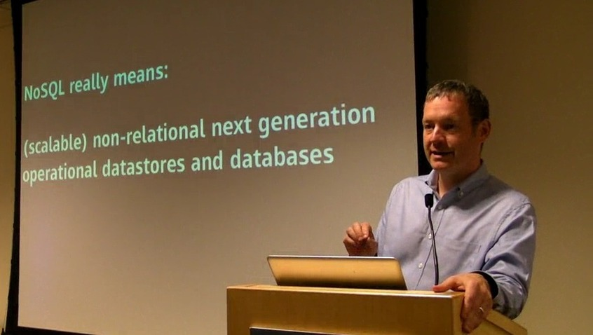
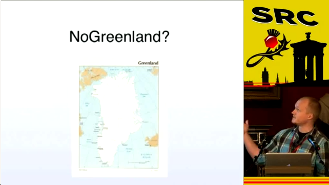
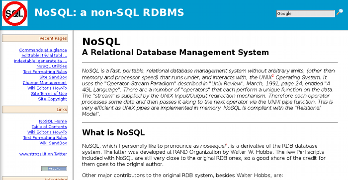
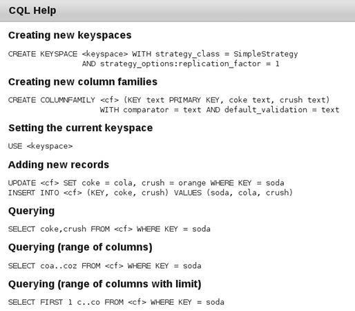

!SLIDE only-title

# Capítulo 3 #

# Introducción a MongoDB #

!SLIDE incremental

# MongoDB: Definición general #

* Base de datos orientada a documentos (objetos)
* Encaja en lo que llaman *NoSQL*...
* ... ¿NoSQL?

!SLIDE only-title

# ¿Qué es NoSQL?

!SLIDE nosql-wikipedia
# NoSQL: El término (1) #

* Ampliamente utilizado para referirse a cualquier BBDD no relacional

  In <a href="/wiki/Computing" title="Computing">computing</a>, <b>NoSQL</b> is a broad class of <a href="/wiki/Database_management_system" title="Database management system">database management systems</a> that differ from classic <a href="/wiki/Relational_database_management_system" title="Relational database management system">relational database management systems</a> (RDBMSes) in some significant ways. These data stores may not require fixed <a href="/wiki/Database_schema" title="Database schema">table schemas</a>, and usually avoid <a href="/wiki/Join_%28SQL%29" title="Join (SQL)">join</a> operations and typically <a href="/wiki/Scalability#Scale_horizontally_.28scale_out.29" title="Scalability">scale horizontally</a>. Academics and papers typically refer to these databases as <b>structured storage</b>,<a href="#cite_note-0">[1]</a><a href="#cite_note-1">[2]</a><a href="#cite_note-2">[3]</a><a href="#cite_note-3">[4]</a> a term that would include classic relational databases as a subset.

!SLIDE

# NoSQL: El término (2) #

Dwight Merriman, CEO &amp; Co-Founder (10gen)

@dmerr

(scalable) non-relational next generation operational datastores and databases.

!SLIDE incremental
# NoSQL: El término (3) #

* Demasiado genérico
* No aclara el tipo real de base de datos
  * Documentos
  * Clave/valor
  * Columnas
  * ...
* Más de 80 BBDD en http://nosql-databases.org/
* Se centra en el lenguaje de consulta (SQL)
  * El verdadero cambio está en la arquitetura
  * Incluso se podría utilizar SQL para BBDD no relacionales
    * Cassandra usa CQL

!SLIDE
# NoSQL: El término (4) #

On the Papers of Giants: Understanding data storage

@ethangunderson

!SLIDE incremental
# NoSQL: El término (5) #

* Hay un RDBMS que no usa SQL...
* ... y se llama <b>NoSQL</b>
  * http://www.strozzi.it/cgi-bin/CSA/tw7/I/en_US/nosql/Home%20Page
  * http://packages.debian.org/nosql
  * Desde 1998
  * 

!SLIDE

# NoSQL: CQL en Cassandra #

* *Cassadra Query Language*
* Introducido en Cassandra 0.8 (3 de junio de 2011)

!SLIDE
# NoSQL: El término (6) #

* ¡Un término horrible!
* Quizá, demasiado extendido para evitar que se use

